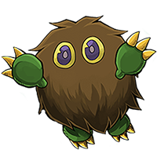
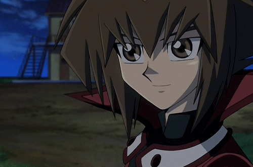

 </img>
# ***Hey ya!*** How are you doing lately? Its   *Onur Akın*.

Currently, I have been doing bunch of stuff. Trying to learn new things, trying to catch up with uni and ofcourse trying not to loose my mind while trying to figure out what am I gonna do with my life after university and some existential thoughts and pains...

Just joking and fooling around though 😅😅 I hope you all doing well and not finding errors in your code. Mainly I create this account in order to exhibit my poorly written code trails and maybe but maybe develope them into something better (I hope they will be get better) and useful!
## *Programming stuff*
My main interests in programing write now;

  
| $${\color{lightblue}\space Programming \space Languages \space that \space I \space tried \space before \space}$$  |  $${\color{lightblue}\space My \space Personal \space Perception \space of \space My \space Level \space}$$ |  $${\color{lightblue}\space How \space Much \space I \space Liked \space The \space Language \space}$$  |
|-|-|-|
|  Python  | ⭐ ⭐ ⭐  ||
|  HTML (with CSS)  |  ⭐ ⭐ ⭐ ⭐  ||

  

In future I would like to learn Javascript, Pyscript and might be C++ (still not sure). For instance you might wanna check the codes that I wrote (and still writing) for homeworks which given while taking courses from *[SEOEM Academy](https://academy.seoem.co/)*: **[SEOEM-Front-End-Egitimi](https://github.com/onurakinakbal/SEOEM-Front-End-Egitimi)**

## *Other stuffs that I am interested in*
- Chemistry
- Science in general
- [Unturned (Game)](https://steamcommunity.com/id/onurakinakbal/stats/304930) 
- Books, movies etc. etc. usual stuff
  
  
And we are ending with a popular quote from Atatürk;
  
    
>Umutsuz durumlar yoktur, umutsuz insanlar vardır. Ben hiçbir zaman umudumu yitirmedim. 

***Gazi Mustafa Kemal Atatürk***

### ***'Till next time we meet again... Gotcha!***

 </img>
